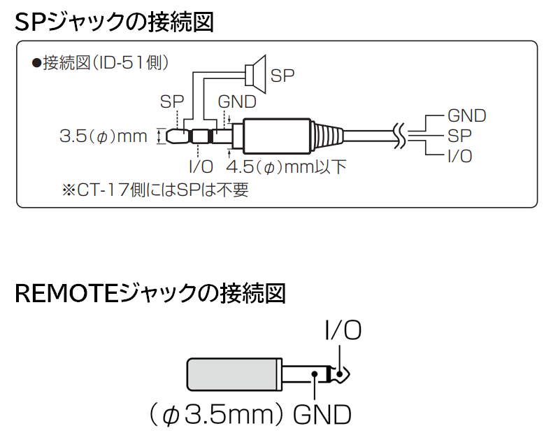

# CI-V
CI-V communication utilities

## utilities
- `civ.py`: IC-7300, ID-51もしくはIC-R6とCI-Vによる通信を行うユーティリティ。
  - CIVクラスのインスタンス化の時にリグの名称を渡すことで、リグのアドレス設定および、Baudrateが設定されます。
  - I-COMの他の機種にも対応できるように改変する予定です。
  - とりあえず動くことはIC-7300で確認済み。少しずつ綺麗に整えていく予定です。

- `ci-v_gui.py`: IC-7300に接続してスコープを表示するGUIアプリ。完成度30%。
  - CI-Vの通信部分は`civ.py`を使っています。
  - スコープ表示の更新速度が遅いので修正予定です。
  - GUIがめちゃくちゃなので実用的なレベルになるまで修正予定です。
  - 必要となるPythonモジュールは`requirements.txt`を参照してください。

- `test_civ.py`: USBで接続したIC-7300からリグに表示している周波数の情報を取得するサンプルです。
  - 取得した周波数はターミナル上に表示されます。
  - すでにFT8を運用している方はpyserialをインストールするだけで動くと思います。
  - 他のリグでテストしたい時は、`ADDR_RIG`の値を下の表を参考に書き換えてください。
  - リグ によって使える機能、使えない機能があります。詳細はそれぞれのリグの取扱説明書を参照してください。

## デフォルトのCI-Vアドレス

- I-COMの取扱説明書からピックしました。（2023年11月現在）
- 無線機ごとに選択可能なBaudrateが異なるため、取扱説明書で確認してください。

| Model | Default Address | Note | max baudrate [bps] |
| - | - | - | - |
| ID-52 | `0xA6` | USB経由、SP経由は動作保証対象外 | |
| ID-50 | `0xAE` | USB経由、SP経由は動作保証対象外 | |
| ID-51 Plus2 | `0x86` | SP | 19200 |
| IC-T10 | `n/a` | CI-Vなし | `n/a` |
| IC-S10 | `n/a` | CI-Vなし | `n/a` |
| ID-31 Plus | `n/a` | CI-Vなし | `n/a` |
| IC-7851 | `0x8E` | USB経由、REMOTE | |
| IC-7610 | `0x98` | USB経由 | |
| IC-7300 | `0x94` | USB経由、REMOTE | 115200 |
| IC-905 | `0xAC` | USB経由 | |
| IC-705 | `0xA4` |  | |
| IC-9700 | `0xA2` | USB経由、DATA | |
| IC-7100 | `0x88` | USB経由、REMOTE | |
| IC-R8600 | `0x96` | USB経由 | |
| IC-R30 | `0x9C` | 付属USBケーブル経由、SP経由は動作保証外 | |
| IC-R6 | `0x7E` | SP | 19200 |

## USB - CI-Vインタフェース
- ICOM CT-17が生産終了で入手困難です。インタフェースについては自作しましたレポートがネットにたくさんありますので検索してみてください。
- 参考の回路図は秋月のAE-CH340Eを使ったものです。USBシリアルインタフェースは色々な種類が売られています。出力電圧に注意して選択すると良いと思います。
- フォンジャックの端子については、各無線機の取扱説明書をしっかり確認してください。

## SPジャック、REMOTEジャック配線図
- SP/REMOTEジャックの配線図の代表例を示します。各無線機の取扱説明書をしっかり確認してください。

## Reference
### CI-V
- I-COM IC-7300 補足説明書
    - [I-COMのホームページ](https://www.icom.co.jp/support/personal/)から検索してください。
- [My Project／第11回　【１度やってみたかった！】 CI-Vでハンディー機をリモート制御 ｜2017年8月号 - 月刊FBニュース　アマチュア無線の情報を満載](https://www.fbnews.jp/201708/myproject/)

### serial communication
- [Welcome to pySerial’s documentation — pySerial 3.4 documentation](https://pyserial.readthedocs.io/en/latest/index.html)

### matplotlib
- [Matplotlib でプロットの更新を自動化する方法 | Delft スタック](https://www.delftstack.com/ja/howto/matplotlib/how-to-automate-plot-updates-in-matplotlib/)
- [matplotlibのめっちゃまとめ #Python - Qiita](https://qiita.com/nkay/items/d1eb91e33b9d6469ef51)
- [【Matplotlib】目盛と目盛ラベル、目盛線の設定 │ Python 数値計算入門](https://python.atelierkobato.com/tick/)

### Others
- [Markdown表テーブル作成ツール | NotePM](https://notepm.jp/markdown-table-tool)
- [RubbaBoy/BYOB: Bring Your Own Badge - Create dynamic README badges based off of your GitHub Actions](https://github.com/RubbaBoy/BYOB)

